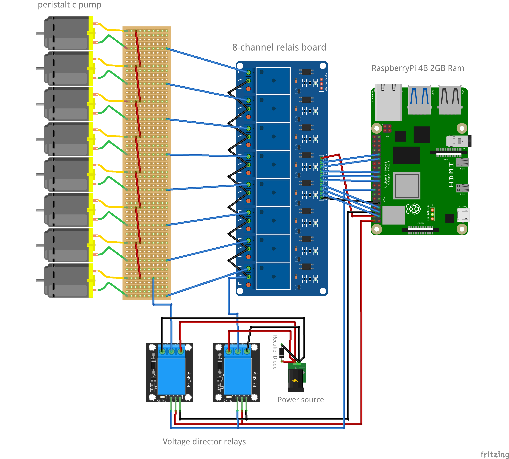
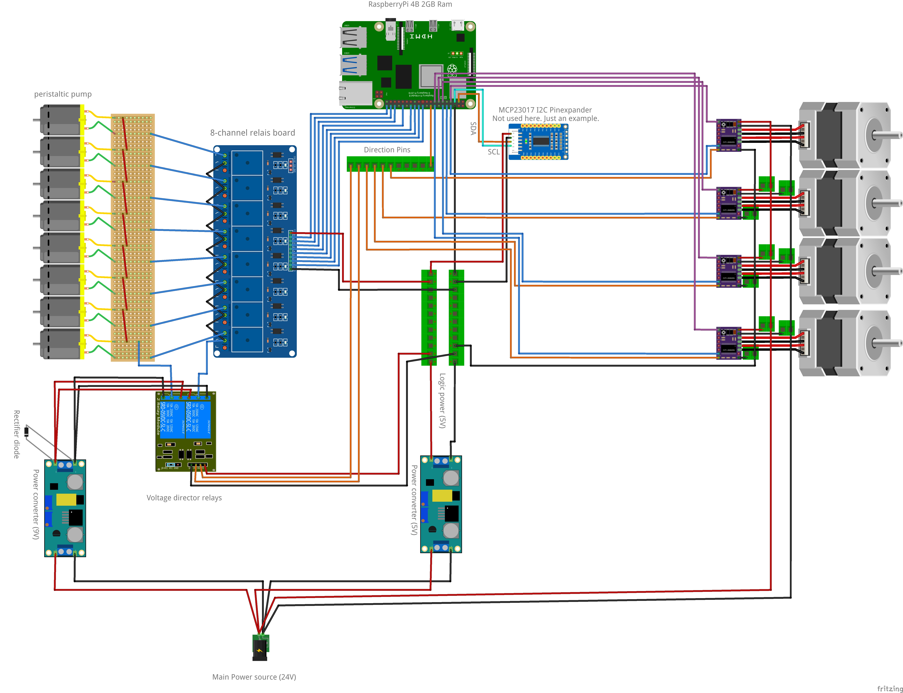

# CocktailMaker

**Main Project Website:** [Click me](https://alexander.liggesmeyer.net/portfolio/cocktailmaker/)  
**Parts list for reproduction:** [Click me](https://alexander.liggesmeyer.net/portfolio/cocktailmaker/#build-the-hardware)  
**Software setup Instructions:** [Click me](https://alexander.liggesmeyer.net/portfolio/cocktailmaker/install)  
**Community & Support:** [Discord - Click me](https://discord.gg/kGy7Up4b6S)  

The “Cocktail-Maker” is not only a piece of software. 
It’s a cocktail-mixing-machine, that works with a Raspberry-Pi, 
that controls multiple pumps, which have different ingredients assigned. 
The Cocktail-Maker provides a UI, that can be accessed via web browser. 
Admins can create other users and assign them to multiple roles with 
different permissions. Users can create own cocktails and if the 
Cocktail-Maker has all the needed ingredients, they can order them. 
Cocktails can be categorized and shared with other users.

New recipes can be created in the UI. The user can add ingredients to 
different production steps. Ingredients that are in the same 
production step get bottled at the same time. 
The order in which ingredients get bottled can be changed via drag & 
drop.

# Main Features:

The controlling software is designed to enhance your cocktail-making experience like never before. With its advanced features, you can easily create and customize your favorite cocktails with just a few clicks.
- Add and edit recipes within the user interface.
- Extra user interface for enhanced local touchscreen usage.
- Virtual stirring functionality.
- Switch between user interface languages.
- Support for up to 153 dc pumps using GPIO expanders.(No software limit)
- Add written production steps to recipes
- Prompt user to hand add ingredients, that are owned, but no connected to a pump
- Manual activation of pumps (as a cleaning program)
- Ingredient substitution for greater flexibility.
- Put recipes into collections and categories
- Adjustable default filter
- Custom recipe adjustments can be made while ordering.
- Create recipe collections for easy organization.
- Multiple users with different roles can be added for greater security.
- Event system allows for triggering custom actions at specific events.
- Manual production steps can be added and prompted during production for greater precision.
- Automatically detect which recipes can be ordered and which cannot, for smoother operation.
- _And much more …._

# Demo
A demo can be found here: https://cocktailmaker-demo.liggesmeyer.net/
User: Admin  
Password: 123456  

# Call to action
Developing the software for this cocktail machine took a lot of time, and I still have features in mind that I want to implement. The cocktail maker software doesn’t send any data to me or other third parties, so I don’t get any feedback when someone is using the software. If you like the project, please consider giving it a „star“ on GitHub so that I can see that people are using it. Alternatively, I would also appreciate donations. The latter can be done here: https://github.com/sponsors/alex9849

# Build the hardware

You can find a more detailed instruction with an example list of building parts on my website: https://alexander.liggesmeyer.net/portfolio/cocktailmaker/#build-the-hardware

In order to use this machine in a useful way, you need to build your own hardware.
In simple words produces the Cocktail-Maker-Software different recipes by 
controlling a relay board, that opens or closes the electronic circuit 
for multiple pumps, which pump the different liquids into the glass.
The user can add new pumps in the webinterface, where he has to specify a GPIO-Pin
for every pump and how long that pumps needs to pump exactly one centiliter in 
milliseconds. You can build your machine as you like. The only important thing
is that you need to be able to apply that concept to your setup.
### This is an example setup:

### ...or with voltage director relays, that allow reverse pumping:

### ...or with GPIO expander, voltage director, stepper and dc pumps:

### This is the hardware that I've used for my machine:
You can find the list and an installation tutorial on my website: https://alexander.liggesmeyer.net/portfolio/cocktailmaker/#build-the-hardware

# Installation

An installation tutorial can be found here: https://alexander.liggesmeyer.net/portfolio/cocktailmaker/install

# Community & Support

If you have questions, want to share your setup or just want to talk about cocktail machines, feel free to join our discord server: [Click me](https://discord.gg/kGy7Up4b6S)
